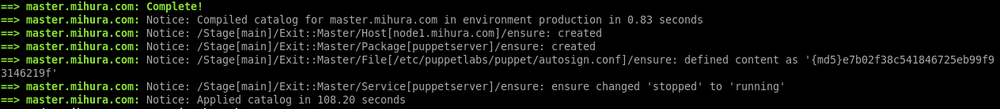
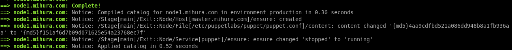

# This is repo for final task 

<h3>Exit task results:</h3>
*  ```Vagrantfile``` ([Vagrantfile](Vagrantfile))

<h3>Manifests:</h3>
* ```init.pp``` ([init.pp](exit/manifests/init.pp))
* ```master.pp``` ([master.pp](exit/manifests/master.pp))
* ```node.pp``` ([node.pp](exit/manifests/node.pp))

<h3>Facter variable:</h3> 
* ```is_puppetmaster.rb``` ([is_puppetmaster.rb](exit/lib/facter/is_puppetmaster.rb))

<h3>Screenshots:</h3>
* <b>Vagrant up:</b>
 - <b>Master</b>


 - <b>Node/b>
 

 - <b>Full log: /b>
* ```vagrant_up.log``` ([vagrant_up.log](/pic/vagrant_up.log))

<h3>Test on node:</h3>


<h3>Test with puppet-lint:</h3>


